# Tes Teknis Website Dimas.Net - PT Dutakom Wibawa Putra

Soal

## Description

Tes Teknis ini digunakan untuk persyaratan tahap seleksi magang di PT. Dutakom Wibawa Putra

## Biodata Mahasiswa
Nama : Dimas Rosyidin

Jurusan : Teknologi Informasi/Sistem Informasi Bisnis

NIM : 2241760054

Asal Instansi : Politeknik Negeri Malang

### Fitur Utama

- Landing Page
- Login/Register Page
- Home Page
- Profile Page
- Transaksi Page
- Riwayat Transaksi Page

### Demo Website (Gambar Kerja Sistem)

- Landing Page
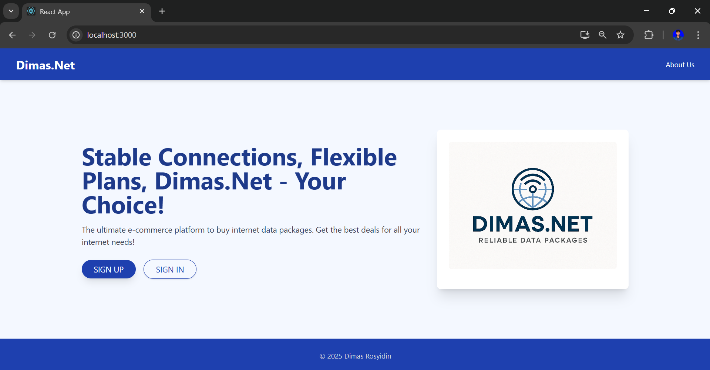
- Login
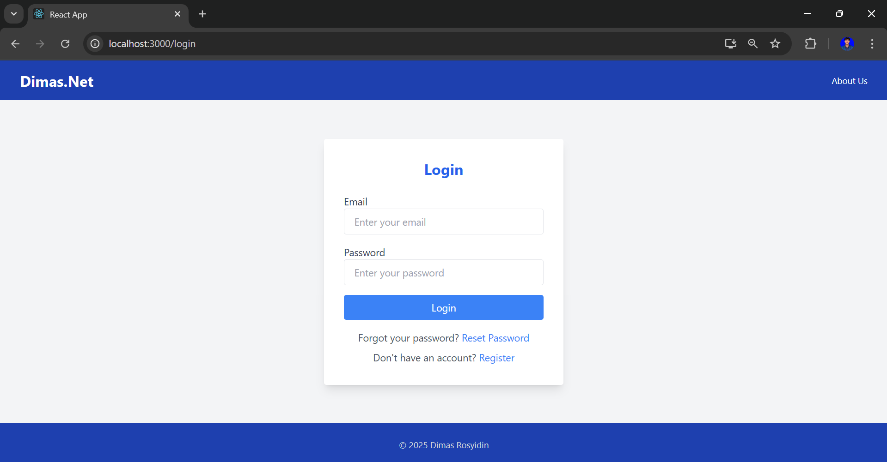
- Register 
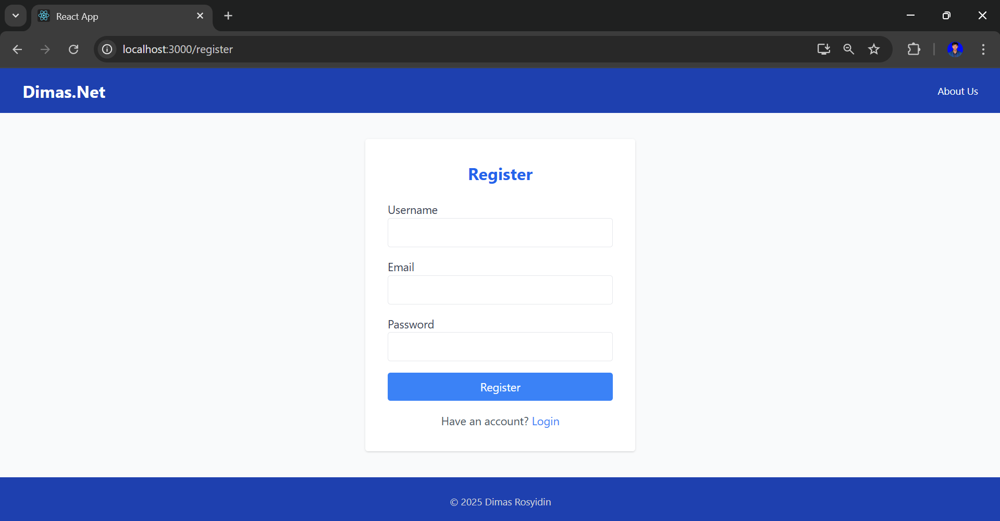
- Home 
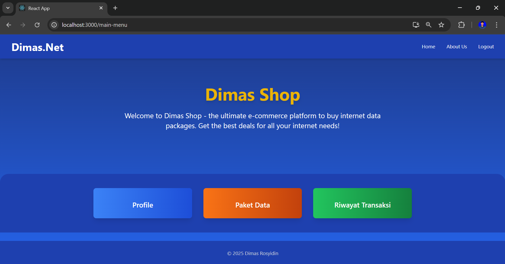
- Profile 
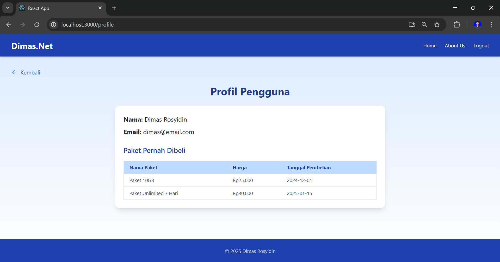
- Transaksi 
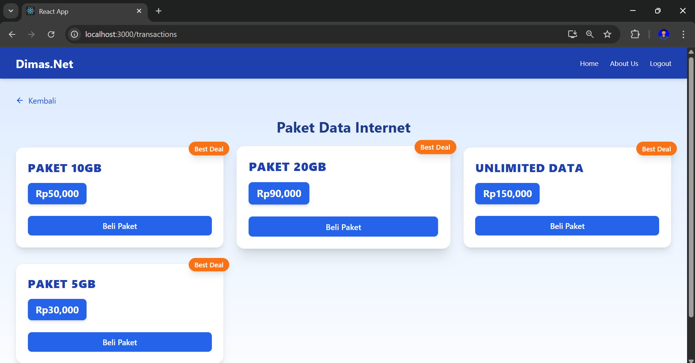

        Pada transaksi ini, pengguna dapat memilih nama paket data dan harga
- Checkout 
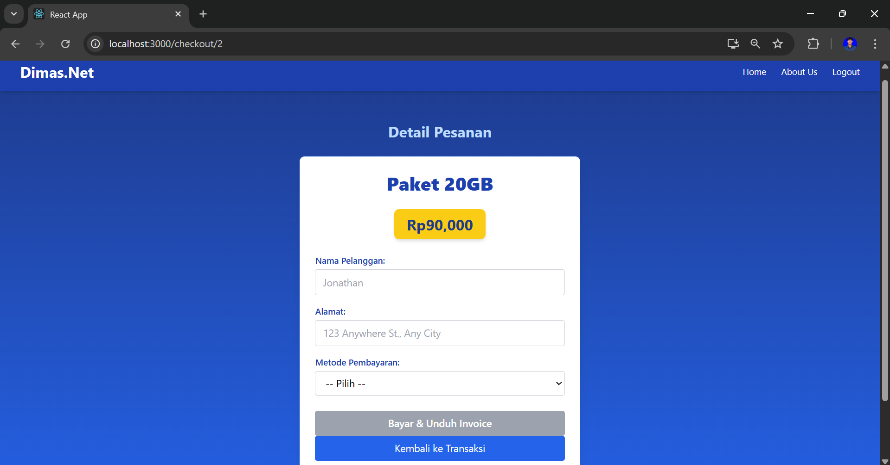
        Pada fitur checkout, setelah memilih paket data. Pengguna dapat mengisi nama, alamat dan metode pembayaran 

- Cetak Inovice
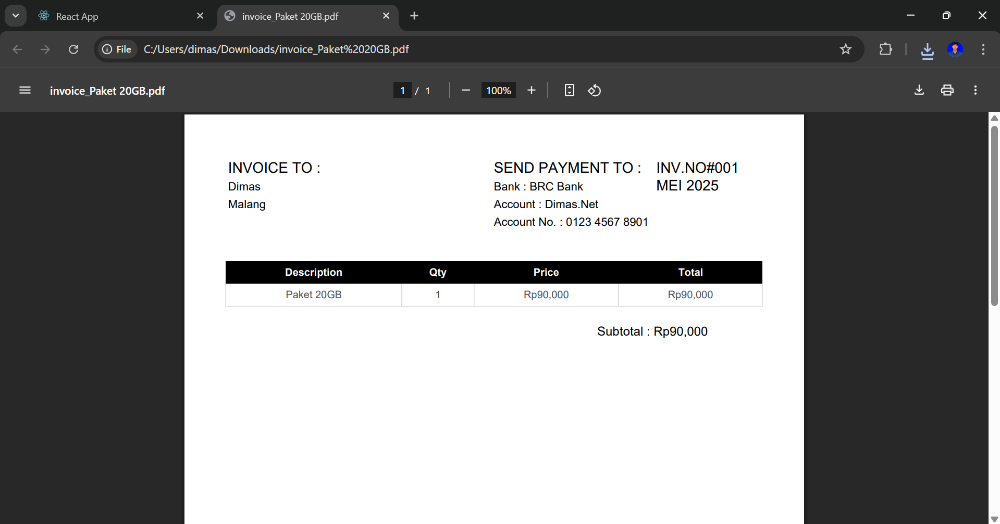
Pada fitur cetak invoice, setelah checkout paket data. Pengguna dapat mendownload invoice berupa pdf
- Riwayat Transaksi 
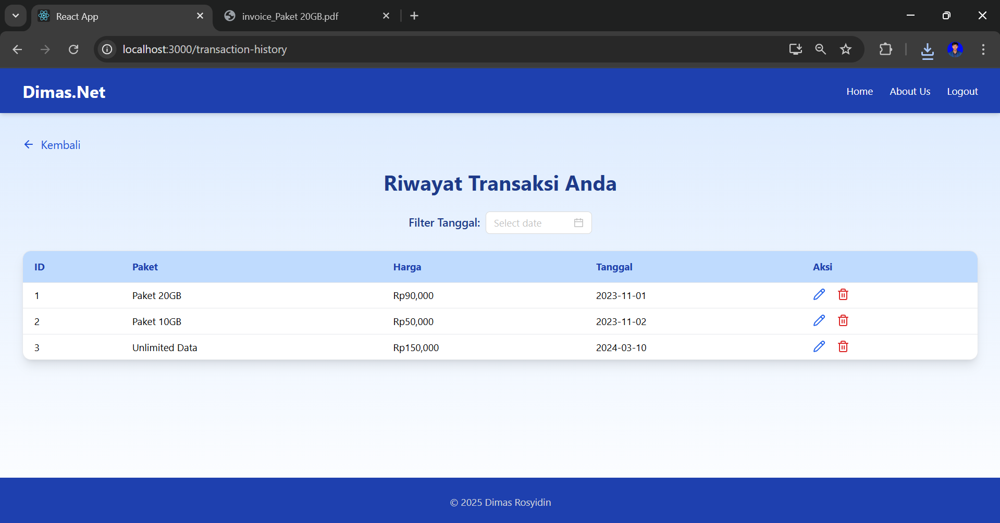
Pada riwayat transaksi, pengguna dapat memfilter tanggal transaksi serta dapat edit dan hapus riwayat transaksi
- API (Endpoint Dummy)
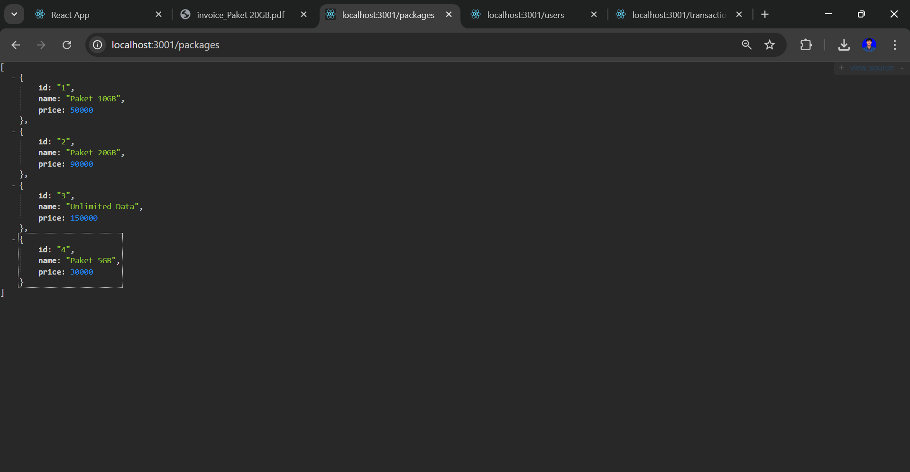
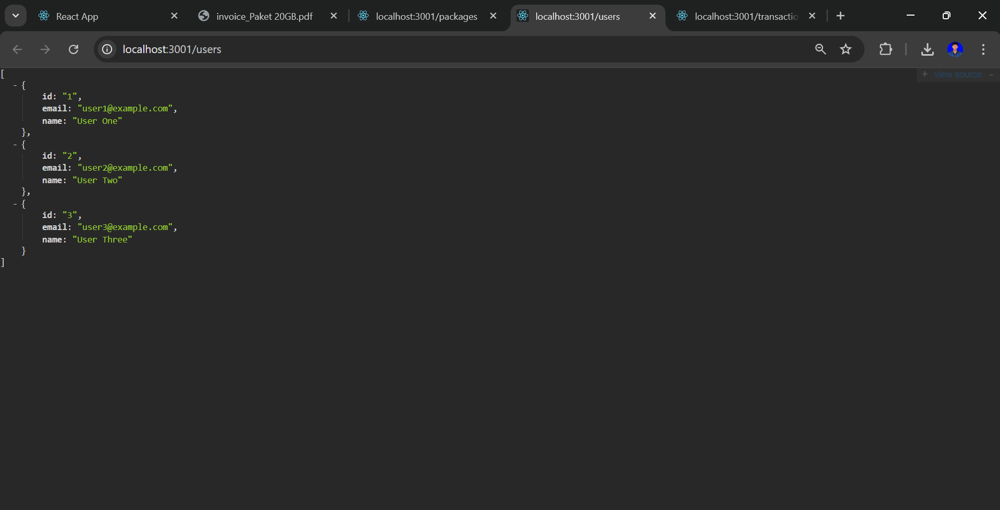
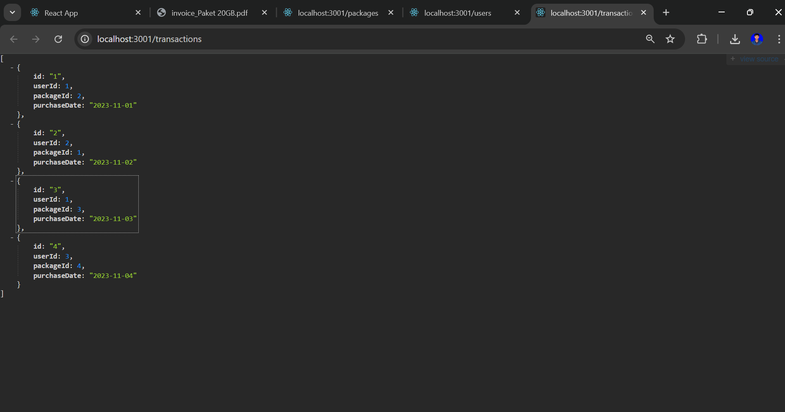

### Terima Kasih:)
